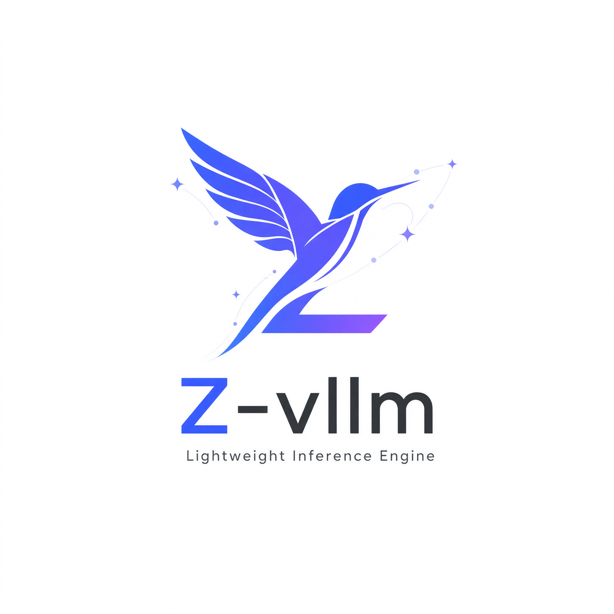

<p align="center">

</p>

# Nano-vLLM

从零实现的轻量级 LLM 推理引擎，个人二次开发项目。

约 1,250 行 Python 代码，完整实现现代 LLM 推理的核心机制：PagedAttention、continuous batching、prefix caching、chunked prefill、张量并行、CUDA graph、torch.compile。推理吞吐与 vLLM 相当（见 [Benchmark](#benchmark)）。

## 特性

* 🚀 **快速离线推理** — 吞吐与 vLLM 相当
* 📖 **可读的代码库** — 约 1,250 行 Python，完整推理管线清晰可见
* 📦 **PagedAttention** — KV cache 按 256-token 块管理，显存无碎片
* 🔁 **Continuous batching** — 以迭代为粒度动态拼批
* ✂️ **Chunked prefill** — 长 prompt 分块 prefill，与 decode 交错执行
* 🧩 **Prefix caching** — 相同前缀跨请求共享，节省 prefill 计算
* 🧮 **张量并行** — 支持 1–8 卡
* ⚡ **CUDA graph + torch.compile** — 捕获 decode 图，降低 launch 开销
* 🤖 **支持 Qwen3 系列模型**

## 项目结构

```
.
├── example.py                # 快速上手示例
├── bench.py                  # 吞吐基准测试脚本
├── assets/logo.png
└── nanovllm/
    ├── __init__.py           # 对外 API：LLM、SamplingParams
    ├── llm.py                # LLM 入口（即 LLMEngine）
    ├── sampling_params.py    # 采样参数
    ├── config.py             # 引擎配置
    ├── engine/
    │   ├── llm_engine.py     # 主引擎：请求接入、调度循环、输出汇总
    │   ├── scheduler.py      # continuous batching + chunked prefill 调度
    │   ├── block_manager.py  # PagedAttention 块分配 + prefix cache
    │   ├── model_runner.py   # 每 rank 的模型执行（CUDA graph、TP）
    │   └── sequence.py       # 请求序列（Sequence）管理
    ├── layers/               # 推理专用算子（TP-aware）
    │   ├── attention.py      # PagedAttention
    │   ├── linear.py         # 列/行并行 Linear
    │   ├── layernorm.py
    │   ├── activation.py
    │   ├── rotary_embedding.py
    │   ├── sampler.py
    │   └── embed_head.py
    ├── models/
    │   └── qwen3.py          # Qwen3 模型定义
    └── utils/
        ├── context.py        # TP 通信上下文
        └── loader.py         # 权重加载
```

## 安装

环境要求：

* Python 3.10 – 3.12
* NVIDIA GPU + CUDA
* [flash-attn](https://github.com/Dao-AILab/flash-attention)（可能需按官方指引编译安装）

```bash
git clone https://github.com/jijic137/nano-vllm.git
cd nano-vllm
pip install -e .
```

依赖由 pip 自动解析安装：`torch>=2.4`、`triton>=3`、`transformers>=4.51`、`flash-attn`、`xxhash`。

## 模型下载

```bash
pip install -U huggingface_hub
huggingface-cli download --resume-download Qwen/Qwen3-0.6B \
  --local-dir ~/huggingface/Qwen3-0.6B/ \
  --local-dir-use-symlinks False
```

## 快速开始

完整示例见 `example.py`。API 风格对齐 vLLM：

```python
from nanovllm import LLM, SamplingParams

llm = LLM("/YOUR/MODEL/PATH", enforce_eager=True, tensor_parallel_size=1)
sampling_params = SamplingParams(temperature=0.6, max_tokens=256)
outputs = llm.generate(["Hello, Nano-vLLM."], sampling_params)
print(outputs[0]["text"])
```

### 主要参数

`LLM(model, **kwargs)`，其中 `model` 为本地模型目录：

| 参数 | 默认值 | 说明 |
|---|---|---|
| `max_num_batched_tokens` | 16384 | 每个迭代最多调度的 token 数（chunked prefill 预算） |
| `max_num_seqs` | 512 | 最大并发请求数 |
| `max_model_len` | 4096 | 最大上下文长度（自动不超过模型 `max_position_embeddings`） |
| `gpu_memory_utilization` | 0.9 | KV cache 可占用的显存比例 |
| `tensor_parallel_size` | 1 | 张量并行卡数（1–8） |
| `enforce_eager` | False | True 时禁用 CUDA graph |
| `kvcache_block_size` | 256 | 每个 KV 块的 token 数（须为 256 的倍数） |

`SamplingParams(temperature=1.0, max_tokens=64, ignore_eos=False)`：

* `temperature` 必须 > 0（不支持贪心解码）
* `ignore_eos`：遇到 EOS 仍继续生成到 `max_tokens`（`bench.py` 中用于压测）

`llm.generate(prompts, sampling_params, use_tqdm=True)`：`prompts` 支持 `str` 或 token id 列表；`sampling_params` 可为单个参数或逐请求列表；返回的每个 output 含 `"text"` 字段。

## Benchmark

基准脚本见 `bench.py`。基线数据：

**测试配置**

* 硬件：RTX 4070 Laptop (8GB)
* 模型：Qwen3-0.6B
* 请求数：256 条
* 输入/输出长度：100–1024 token 随机采样

| 推理引擎 | 输出 token 数 | 耗时 (s) | 吞吐 (tokens/s) |
|---|---|---|---|
| vLLM | 133,966 | 98.37 | 1361.84 |
| Nano-vLLM | 133,966 | 93.41 | 1434.13 |

## Roadmap

- [ ] 支持更多模型家族（LLaMA、Qwen2 等）
- [ ] OpenAI 兼容的推理服务接口
- [ ] 权重量化支持（AWQ / GPTQ）
- [ ] 流式（streaming）输出

## 来源与许可

本项目基于 [nano-vllm](https://github.com/GeeeekExplorer/nano-vllm)（Xingkai Yu，MIT License）二次开发，原始版权声明保留在 `LICENSE` 文件中。
